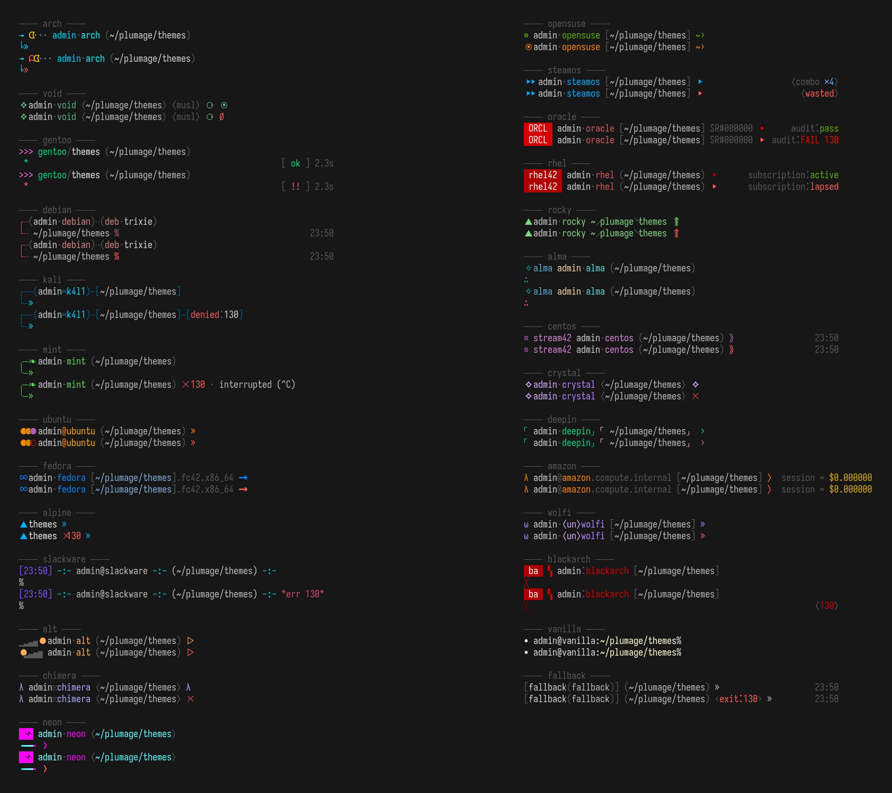
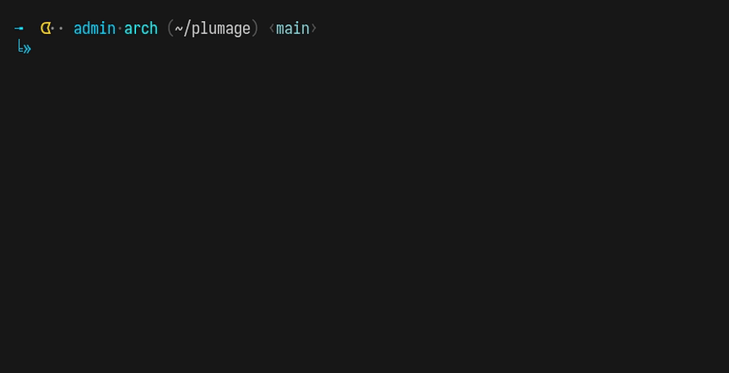

# plumage

**Every distrobox gets its own feathers.**



You know how it goes: distrobox shares your `$HOME`, your `$HOME` carries your
`.zshrc`, and suddenly every container on your machine wears the exact same
prompt as your host. Eight boxes, one face. You `ps` in the wrong one
eventually. Everyone does.

plumage is an oh-my-zsh plugin that gives each distro its own prompt — not a
recolor, a different *bird*. The layouts, the glyphs, the little mechanical
habits: each one is built so your gut says *"this is the debian box"* before
you've read a single word. Your host prompt is not touched. That one is your
PC.

## install

```sh
curl -fsSL https://raw.githubusercontent.com/jstamagal/plumage/main/install.sh | sh
```

or by hand:

```sh
git clone https://github.com/jstamagal/plumage ~/.oh-my-zsh/custom/plugins/plumage
# then add `plumage` to the plugins=( ... ) line in your .zshrc
```

Open a new shell, `distrobox enter` anything, done. Because distrobox shares
your home, one install covers every box you have and every box you will ever
create. The container needs zsh installed; that is the whole requirements
list. No special fonts — every glyph here is ordinary Unicode.

## the flock

| theme | you will know it by |
|---|---|
| `alma` | teal and gold; notes `↻ risen` when a command succeeds after a failure |
| `alpine` | one peak, one path, one chevron — smaller than its own comment block |
| `alt` | a boulder that climbs `▁▂▃▄▅` with your success streak and never, ever stays up |
| `amazon` | `user@box.compute.internal`, and the session cost meter is always running |
| `arch` | a cyan line where something chomps a pellet per command; fail and a ghost slips in behind you |
| `blackarch` | arch gone over to the red side, re-tuning its static every command |
| `centos` | purple water, a `stream9` badge floating past |
| `chimera` | the prompt glyph rotates λ ψ μ — three heads, one animal |
| `crystal` | every directory hashes to its own gem, same one every time you return |
| `debian` | dotted oxblood rails and the release codename on the door |
| `deepin` | 「jade」and「peach」corner brackets, everything in its place |
| `fedora` | blue ∞, and your path wears a `.fc42.x86_64` release tag |
| `gentoo` | `>>>` build-output lines; the right margin times your last command and stamps it `[ ok ]` or `[ !! ]` |
| `kali` | steel rails, the box name gets the number treatment (`k4l1`), failures logged as denials |
| `mint` | soft green, and exit codes explained in English (`✗ 127 · command not found`) |
| `neon` | one lit magenta segment and a tube fading cyan into pink — the sign is always on |
| `opensuse` | the whole skin flips green ⇄ alarm-orange with your last exit; the eye watches |
| `oracle` | red badge, `SR#000042` numbering, audit verdict on every command |
| `rhel` | crimson tab; one failed command and your subscription lapses (it comes back) |
| `rocky` | your path drawn as a green ridgeline, `~⟋src⟍pkg` |
| `slackware` | pure ASCII, eight colors, would render on the family VT |
| `steamos` | deck blue with a combo counter; break the streak and it just says `wasted` |
| `ubuntu` | three warm dots that remember your last three exit codes |
| `vanilla` | the theme is that there is no theme |
| `void` | green ❖, a matter trail that lengthens as you `cd` deeper, `∅` on failure, honest musl/glibc badge |
| `wolfi` | lavender ⟨un⟩branding; one tentacle per background job |
| `fallback` | house colors for boxes we have not met |

Every mechanic above is real shell state — exit codes, history numbers,
job tables, streaks, durations, `/etc/os-release`. Nothing is decoration
pretending to be information. Watch it move:



## commands

```
plumage preview          # render the whole flock right in your terminal
plumage preview void     # just one
plumage list             # names and taglines
plumage use gentoo       # wear any theme in the current shell
plumage off              # put the old prompt back
plumage status           # what am I wearing and why
```

## knobs

| variable | effect |
|---|---|
| `PLUMAGE_THEME=name` | force a theme (works anywhere, even on the host) |
| `PLUMAGE_HOST=1` | dress the host too, by its own distro |
| `PLUMAGE_GIT=0` | skip git lookups in prompts |

## how it picks

`/etc/os-release` `ID` first, then `ID_LIKE`, then a substring match against
the container's name, then `fallback`. The plugin only wakes up when
`CONTAINER_ID` is set (i.e. inside a distrobox), unless you use the knobs
above.

## rolling your own

A theme is one file: `themes/yours.zsh-theme`, sourced after oh-my-zsh has
finished loading. Set `PROMPT` (and `RPROMPT` if you like), and if you need
per-command work, define a function and name it in `PLUMAGE_THEME_PRECMD`.
You get, for free:

```
PLUMAGE_BOX        container name
PLUMAGE_OS_*       ID / VERSION / CODENAME / PRETTY from os-release
PLUMAGE_EXIT       last exit code        PLUMAGE_STREAK   consecutive successes
PLUMAGE_EXITS      last three exits      PLUMAGE_TOOK     last command duration
plumage_git_seg PRE SUF   # branch+dirty mark wrapped in your dressing, or nothing
```

Include a `# tagline:` comment — `plumage list` reads it.

## license

MIT. The typography answers to an older law.
